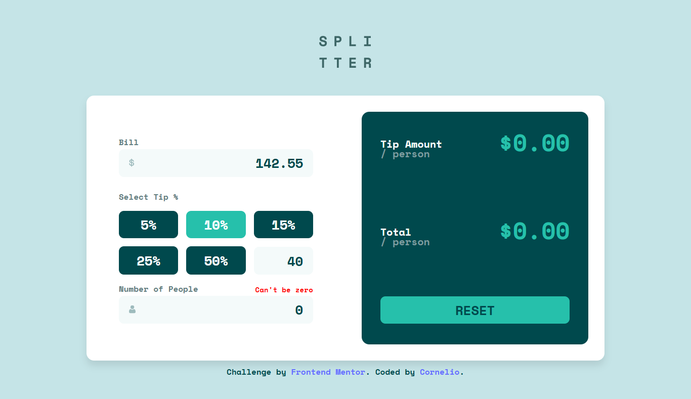

# Frontend Mentor - Tip calculator app solution

This is a solution to the [Tip calculator app challenge on Frontend Mentor](https://www.frontendmentor.io/challenges/tip-calculator-app-ugJNGbJUX). Frontend Mentor challenges help you improve your coding skills by building realistic projects.

## Table of contents

- [Frontend Mentor - Tip calculator app solution](#frontend-mentor---tip-calculator-app-solution)
  - [Table of contents](#table-of-contents)
  - [Overview](#overview)
    - [The challenge](#the-challenge)
    - [Screenshot](#screenshot)
  - [Links](#links)
    - [Source code](#source-code)
    - [Live view](#live-view)
  - [Description](#description)
    - [Features:](#features)
  - [My process](#my-process)
    - [Built with](#built-with)
  - [Author](#author)
  - [Got feedback for me?](#got-feedback-for-me)

## Overview

### The challenge

Users should be able to:

- View the optimal layout for the app depending on their device's screen size
- See hover states for all interactive elements on the page
- Calculate the correct tip and total cost of the bill per person

### Screenshot

## Links

### Source code
- Solution URL: [github.com](https://github.com/Cornelio-II/tip-calculator-app)
  
### Live view 
- Live Site URL: [Tip calculator app](https://Cornelio-II.github.io/tip-calculator-app/)
  

## Description

The Tip Calculator App is a simple and user-friendly tool designed to help you quickly calculate the tip and total cost of a bill. Whether you're dining out with friends or splitting expenses, this app ensures that everyone pays their fair share without any hassle.

### Features:
- Calculate tips based on a custom percentage.
- Split the bill among multiple people.
- Real-time updates as you enter amounts.
- Clean and responsive design for use on any device.

This app is perfect for anyone looking to save time and avoid the confusion of mental math during group outings!

## My process

### Built with

- Semantic HTML5 markup
- CSS custom properties
- Flexbox
- CSS Grid
- Mobile-first workflow
- [Vite](https://vite.dev/) - Vue.js build tool
- [Vue.js](https://vuejs.org) - Vue framework

## Author

- Frontend Mentor - [@Timex29](https://www.frontendmentor.io/profile/Timex29)
- x - [@LlagasCornelio](https://x.com/LlagasCornelio)
- bsky.app- [@cornelio30.bsky.social](https://bsky.app/profile/cornelio30.bsky.social)

## Got feedback for me?

I’d love to hear your thoughts and suggestions about this project! Whether it’s a bug you’ve found, a feature you’d like to see, or just general feedback, your input is highly valuable to me.

Here’s how you can provide feedback:

1. **Report an Issue**: If you encounter a bug or problem, please [open an issue](https://github.com/Timex29/tip-calculator-app/issues).
2. **Feature Requests**: Have an idea for improvement? Let us know by creating a feature request.
3. **Email Us**: Prefer direct communication? Feel free to send your feedback to [https://bsky.app/profile/cornelio30.bsky.social](https://bsky.app/profile/cornelio30.bsky.social).

I appreciate your support and contributions to making this project better!
